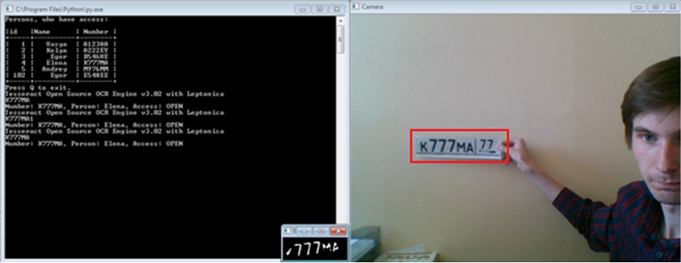

# Rus_Car_Number_Recognizer

<b>This programm works the following way:</b>

Get video-frame from web-camera.

Using OpenCV find on frame car number. You can change the method of finding, wiht using diffrent cascades:

<i>#choose cascade for search 
<i>#cascPath = 'rus_plate_cascade.xml' 
<i>#cascPath = 'haarcascade_licence_plate_rus_16stages.xml' 
<i>cascPath = 'haarcascade_russian_plate_number.xml'</i> 

Cut number and save them in file tes.png

Read this number using Tesseract and write result in file output.txt

Show recognized number in console.

For works, need this components:

1. Install python 2.7 https://www.python.org/downloads/
2. Install NumPy1.9+	https://sourceforge.net/projects/numpy/?source=typ_redirect (https://sourceforge.net/projects/numpy/files/NumPy/1.7.1/numpy-1.7.1-win32-superpack-python2.7.exe/download)
3. Download OpenCV 2.4.х(!) not v3+ https://sourceforge.net/projects/opencvlibrary/files/opencv-win/2.4.13/opencv-2.4.13.exe/download	
4. Download PIL http://www.pythonware.com/products/pil/	
5. Download Tesseract-ocr3.02.exe https://sourceforge.net/projects/tesseract-ocr-alt/files/

Tesseract use Russian alphabet from file rus.traineddata - recognize only russians symbols, which uses in russians car numbers.

<b>ANOTHER INFO IN RUSSIAN :)</b>
 
<b>Эта программа работает следующим образом:</b>

Покадрово обрабатывает изображения с камеры.

Используя OpenCV ищет на изображении автомобильный номер. Можно изменить способ, используя разные каскады:

<i>#choose cascade for search 
<i>#cascPath = 'rus_plate_cascade.xml' 
<i>#cascPath = 'haarcascade_licence_plate_rus_16stages.xml' 
<i>cascPath = 'haarcascade_russian_plate_number.xml'</i> 

Вырезает номер и сохраняет в файл tes.png

Читает этот номер с помощью Tesseract и записывает результат в файл output.txt

Выводит считанный номер в консоль.

Для работы нужны следующие компоненты:
 
1. установить Путхон 2.7 https://www.python.org/downloads/
2. установить НумПу 1.9+	https://sourceforge.net/projects/numpy/?source=typ_redirect (https://sourceforge.net/projects/numpy/files/NumPy/1.7.1/numpy-1.7.1-win32-superpack-python2.7.exe/download)
3. скачать ОпэнСэВэ 2.4.х(!) не 3+ https://sourceforge.net/projects/opencvlibrary/files/opencv-win/2.4.13/opencv-2.4.13.exe/download	
4. скачать ПИЛ http://www.pythonware.com/products/pil/	
5. скачать Тесеракт-оср в 3.02.exe https://sourceforge.net/projects/tesseract-ocr-alt/files/

Шрифт для Tesseract - rus.tranieddata - распознает только буквы алфавита, используемого в русских автомобильных номерах.
